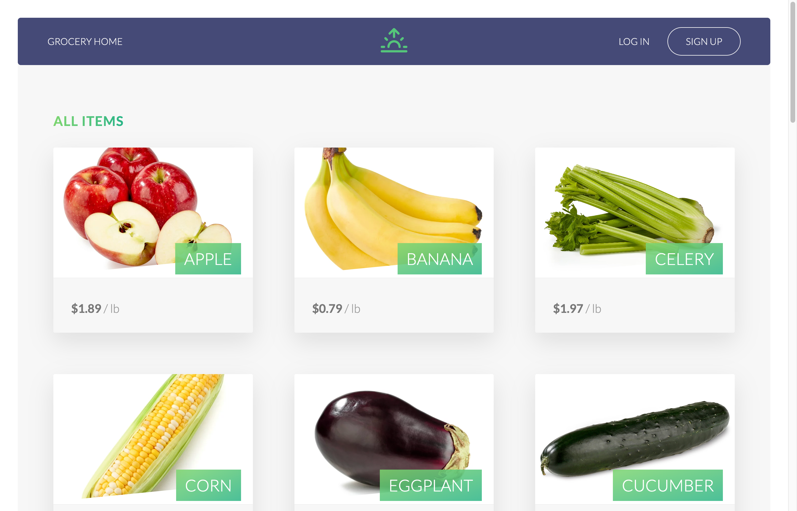
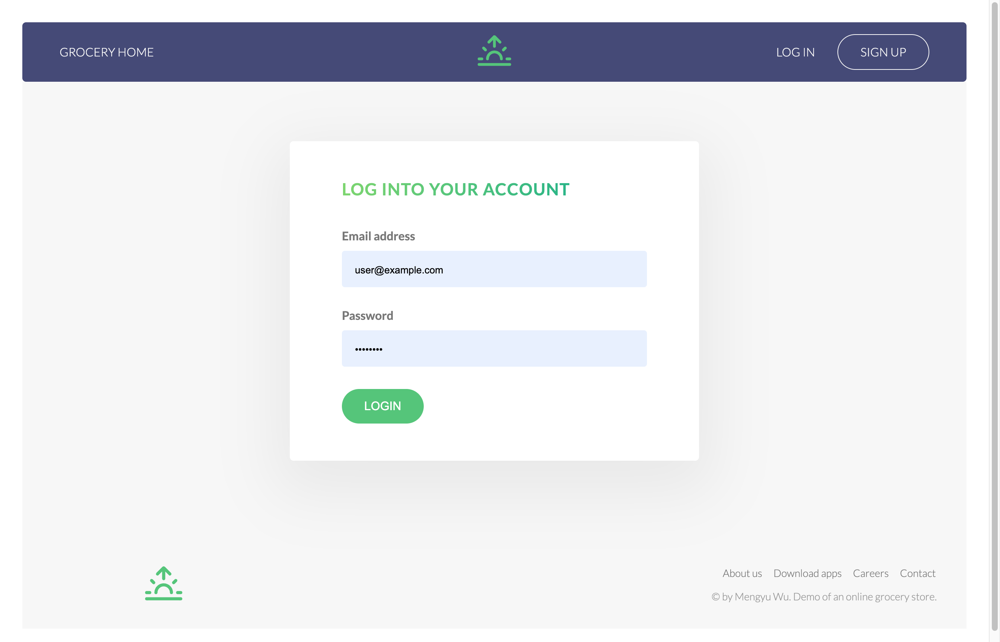
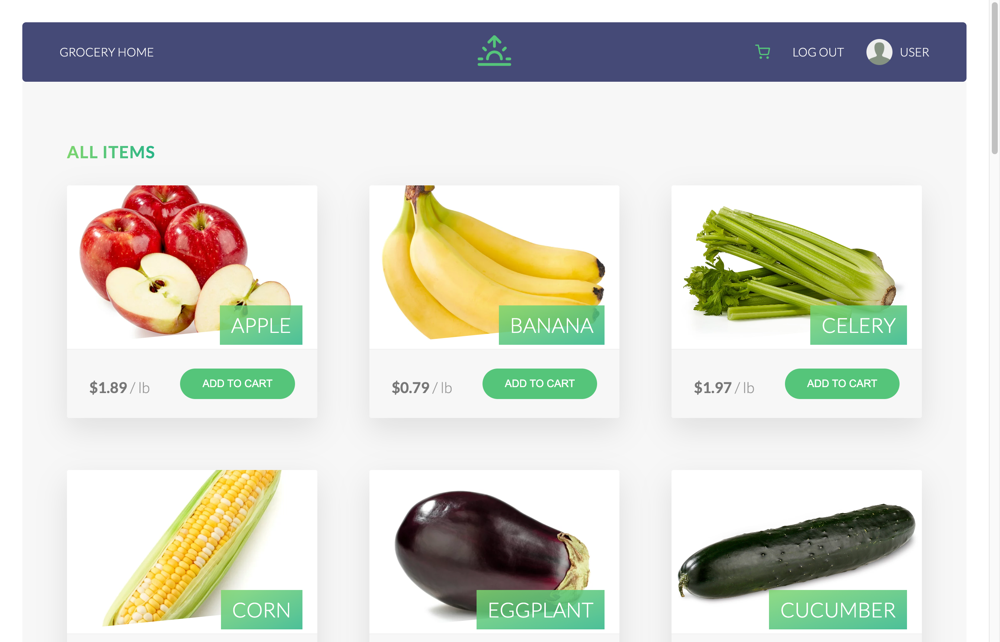
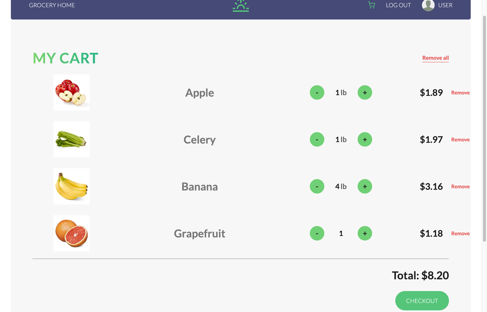
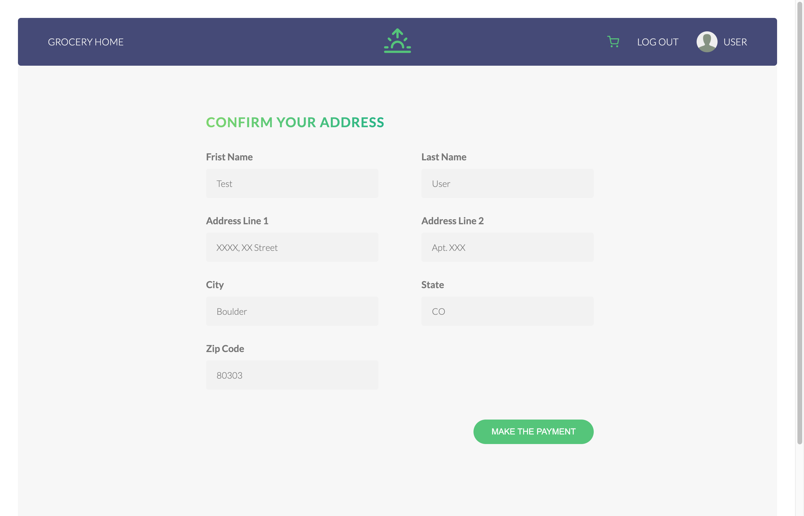
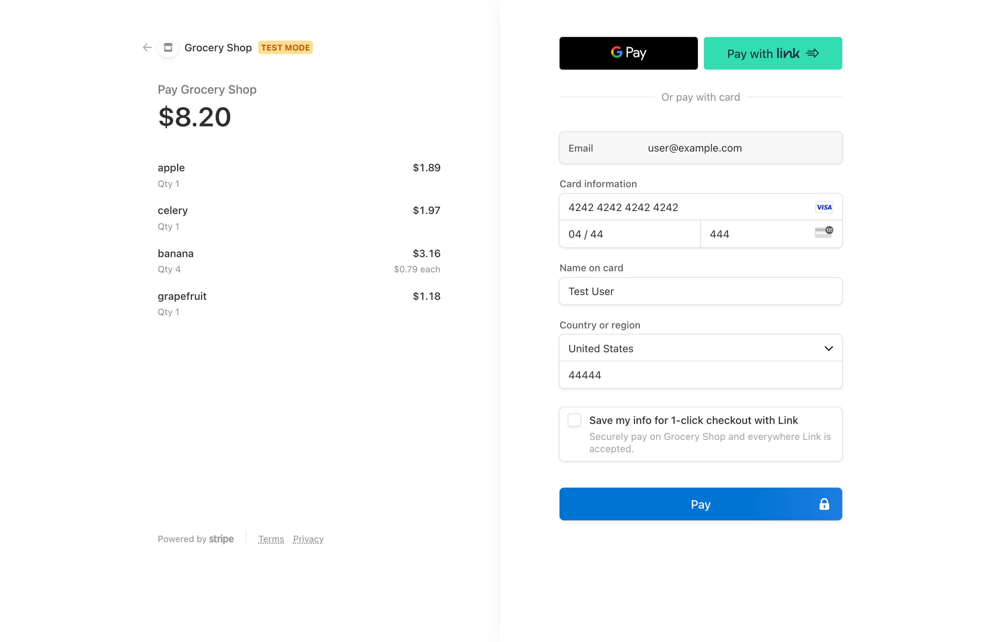
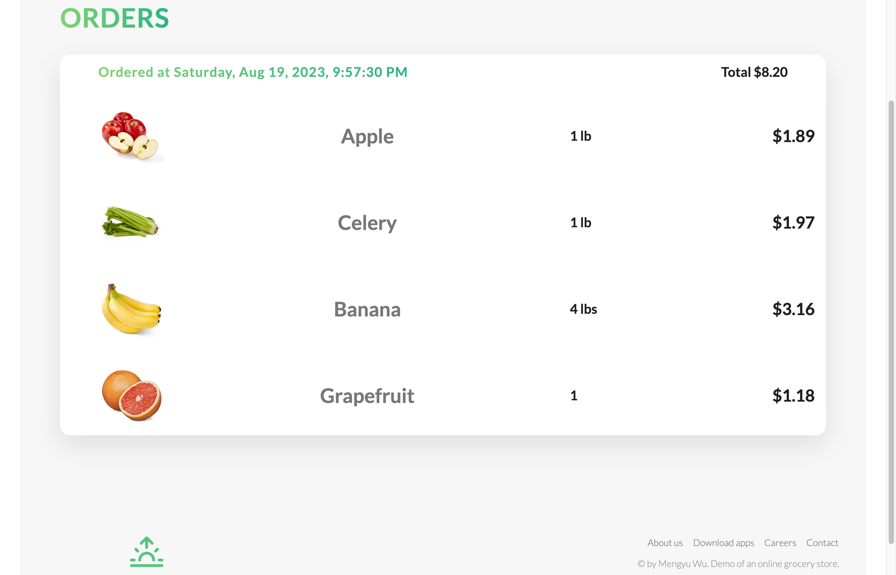
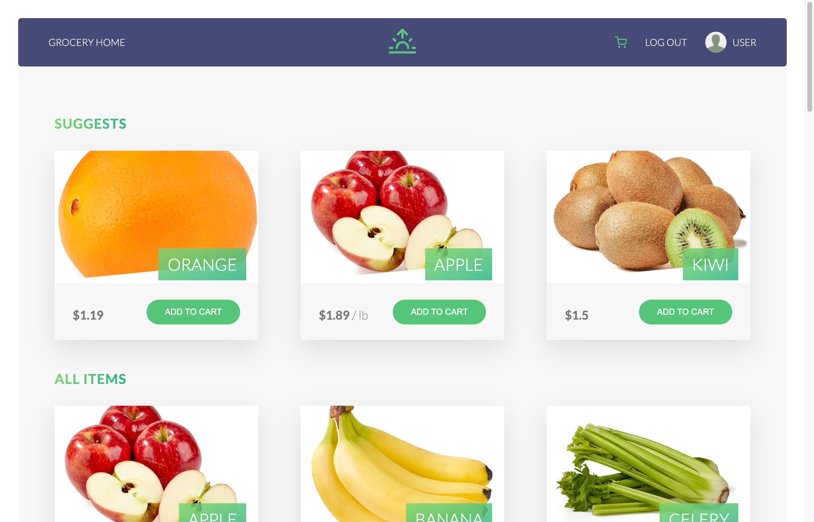

# Online Grocery
This is a demo of an online grocery website application, including both frontend developed using HTML, CSS, JavaScript and React and backend developed using Node.js, express and mongoDB. A suggestion algorithm is also applied, which is based on the order history of the user and suggest the items with similar nutrition facts to the user.

## Homepage
Home page before logging in, user can check prices but need to get logged in to add items into the shopping cart.

## Login

## Homepage(logged in)
User has logged in to get the cart button on the navigation bar and "add to cart" buttons for all items. Since this is a new user with no previous orders, no items are suggested to the user.

## Shopping cart
After adding items to the cart, user can check the cart and modify the items and their quantities, and then checkout.

## Address
After user decide to checkout, he need to confirm or complete the delivery address. The address used last time will be auto filled if possible.

## Make the payment
User will be redirected to stripe.com to finish the payment.

## Orders
After payment, user will be redirected to orders page, where user can see their order history.

## Suggests
When at least one order was made, the homepage will show suggests for the user based on the order history.

